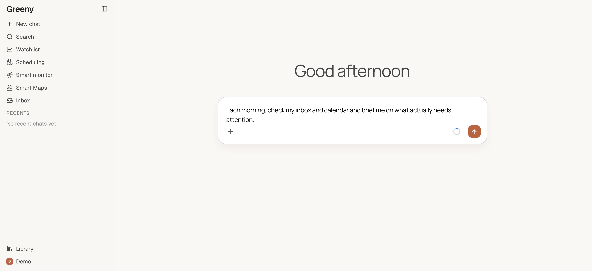
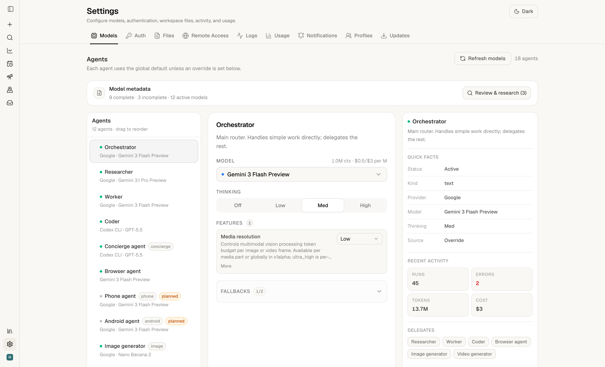
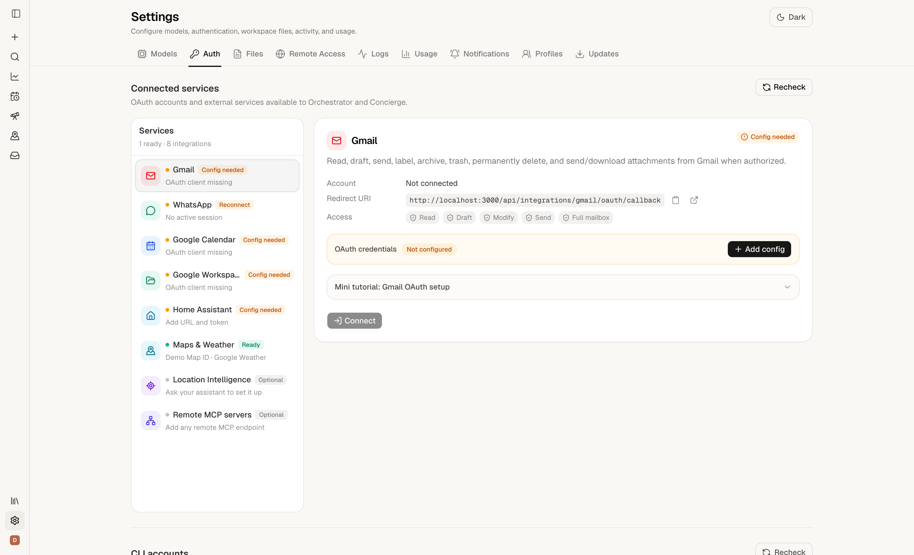
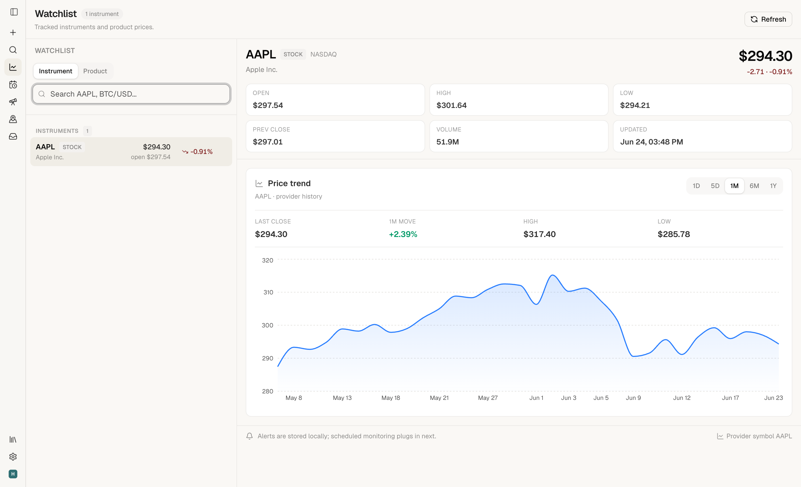

<p align="center">
  
</p>

<h1 align="center">Orchestrator</h1>

<p align="center">
  A self-hosted AI workspace for chat, agents, browser automation, scheduling,
  and your everyday integrations — running entirely on your own machine.
</p>

<p align="center">
  <a href="#quick-start">Quick Start</a> ·
  <a href="#features">Features</a> ·
  <a href="#running-on-a-remote-server">Remote Server</a> ·
  <a href="#security">Security</a> ·
  <a href="#updating">Updating</a>
</p>

<p align="center">
  
</p>

---

Orchestrator runs your personal AI agents on hardware you control. Multi-provider
chat, CLI-backed coding agents, a real browser agent, background automation, and
service integrations — all behind a single local web app, with your keys and data
staying on your machine.

## Quick Start

The one-line installer is the recommended path. On Linux it installs Docker if
needed; on macOS it installs as a managed native service. Either way it sets the
app up and starts it.

```bash
curl -fsSL https://raw.githubusercontent.com/Horia73/orchestrator/master/scripts/install.sh | bash
```

When it finishes, it **prints the URL to open** (`http://127.0.0.1:3000` by
default). Open it and a **setup wizard** walks you through the rest — API keys,
model providers, remote access, and integrations. There's no config file to edit
by hand to get started.

> Prefer plain Docker? `git clone https://github.com/Horia73/orchestrator.git && cd orchestrator && cp .env.example .env && docker compose up --build -d`

## Features

### Chat & agents
- **Multi-provider chat** across Claude, OpenAI, Gemini, and OpenRouter, with per-agent model, thinking level, and automatic fallbacks.
- **One orchestrator** that does the work itself and delegates the rest to specialist sub-agents, shown live as agent cards.
- **CLI-backed coding agents** (Claude Code, Codex) — no API key needed once you're logged in.
- **A vision browser agent** that drives real, logged-in web sessions, with an optional live view you can take control of.
- **Rich inline outputs (artifacts):** markdown, code, live HTML/React, diagrams, SVG, CSV/JSON, maps, weather cards, recipes, interactive workouts, 3D CAD models, and live previews of web apps it builds for you.

<p align="center">
  <br>
  <sub>Per-agent model, thinking level, and fallbacks — in Settings → Models.</sub>
</p>

### Background automation
- **Scheduling** — run anything once later or on a recurring cadence (in / at / daily / weekly / every / cron).
- **Smart Monitor** — one always-on, model-owned monitor that pings you only when something matters and learns to stay quiet about noise.
- **Inbox** — a mail-style home for results, alerts, and proactive proposals from background runs; silent by default.
- **Microscripts** — bounded, deterministic Python checks that can escalate to an agent only after a real match.
- **Inbound webhooks** — authenticated public endpoints (HMAC / Svix / bearer) that dispatch events to microscripts.

### Integrations — connected from Settings, no code
- **Gmail, Google Calendar, Google Workspace** (Drive, Docs, Sheets, Slides, Contacts) — multiple accounts each.
- **WhatsApp** — a local companion session (reads plus confirmed writes).
- **Home Assistant** — read state and control your devices.
- **Smart Maps & Weather** — Google Maps Platform (places, routes, 3D), with a keyless weather fallback.
- **Remote MCP servers** — connect any Streamable HTTP MCP endpoint.

<p align="center">
  <br>
  <sub>Connect services from Settings → Auth — no code, and tokens stay on your machine.</sub>
</p>

### Your workspace & memory
- **Library** — every file, image, voice note, artifact, recipe, map, and workout in one place, with in-app viewers for PDF, Office, code, and more.
- **Durable, tiered memory with semantic recall** — it remembers what matters and surfaces it by meaning, not just keywords.
- **Watchlist** — track stocks, ETFs, FX, and crypto (live quotes + candlestick charts) plus product prices over time.
- **Interactive workouts** with training history, PRs, body metrics, and an in-session AI coach.
- Uploads, voice notes, and generated files all persist privately on your machine.

<p align="center">
  <br>
  <sub>Watchlist — live quotes and price history for the instruments you track.</sub>
</p>

### Multi-profile & self-hosted
- **Netflix-style profiles**, each with isolated data, integrations, and permissions; an admin controls access.
- **One-line install** (Docker or native), backup / restore, and an in-app updater driven by GitHub Releases.
- Everything — keys, tokens, sessions, and data — stays on the machine you run it on.

## Running on a remote server

Installing on AWS, a VPS, or any headless box? Orchestrator binds to `127.0.0.1`
by design, so it is **never exposed just by running on a public host**. SSH into
the server, run the same one-line installer, then reach the app one of two ways:

- **SSH tunnel** — quickest, nothing to configure:

  ```bash
  ssh -N -L 3000:127.0.0.1:3000 user@your-server
  ```

  then open `http://localhost:3000` on your laptop.

- **Public HTTPS** — set it up in-app from the first-run wizard or
  **Settings → Remote Access**. It provisions a DuckDNS hostname, a Let's Encrypt
  certificate, and an nginx reverse proxy for you. This is required if you want
  Google / Gmail sign-in or push notifications on a remote box.

  Already own a domain? Use the manual custom-domain guide instead:
  [docs/custom-domain.md](docs/custom-domain.md).

Either way it's the **same build** — no code changes, just a different way in.

## Configuration

Most configuration happens **in the app** — the first-run wizard and **Settings**
cover API keys, providers, and integrations. You rarely need to touch a file.

For advanced or headless setups, copy the template and edit it directly:

```bash
cp .env.example .env
```

`.env.example` documents every supported variable, including provider keys
(`ANTHROPIC_API_KEY`, `OPENAI_API_KEY`, `GEMINI_API_KEY`, `OPENROUTER_API_KEY`), the watchlist
(`TWELVE_DATA_API_KEY`), Smart Maps (`GOOGLE_MAPS_API_KEY`), Google OAuth, and
Home Assistant.

Persistent data lives at `~/.orchestrator/` and is owned by your host user, so a
backup is a plain `cp -a ~/.orchestrator/ <destination>` (or use **Settings →
Updates → Backup**).

## Updating

Managed installs update from inside the app or the shell:

- **Settings → Updates** shows the installed and latest versions and applies updates.
- `orchestrator update` does the same from the host.

Active AI runs are allowed to finish before an update starts. Manual Docker
checkouts update with `git pull --ff-only && docker compose up --build -d`.

## Security

Orchestrator is a **trusted local application, not a public web service**. By
default it binds to `127.0.0.1`.

- Keep it bound to loopback unless it sits behind a trusted access layer — an SSH
  tunnel, Tailscale, a VPN, or the built-in HTTPS setup with TLS.
- Don't expose it directly to the open internet. Its endpoints can run agents,
  use your local credentials, and execute local tools.
- Private `/api/*` routes are restricted to same-origin or loopback callers;
  non-loopback calls require an API token. This is defense in depth, **not** a
  replacement for authentication at the network edge.

## Diagnostics & uninstall

The installer ships a doctor and a clean uninstaller, exposed through the
`orchestrator` CLI:

```bash
orchestrator doctor            # health check (preflight + state + runtime)
orchestrator uninstall         # remove the install, keep your data
orchestrator uninstall --purge # also wipe ~/.orchestrator and Docker volumes
```

Install and doctor runs log to `~/.orchestrator/logs/`.

## Requirements

- Docker with Compose (recommended Linux deployment), **or** Node.js `22.x` for a
  native install.
- Git.
- API keys for the providers and integrations you want — added in-app.

## License

Licensed under the [GNU Affero General Public License v3.0 or later](LICENSE) —
© 2026 Horia73. You're free to self-host and modify Orchestrator; if you run a
**modified** version as a network service, you must make your source available
to its users under the same license.

---

<p align="center">
  A personal, self-hosted project — run it on your own machine.
</p>
